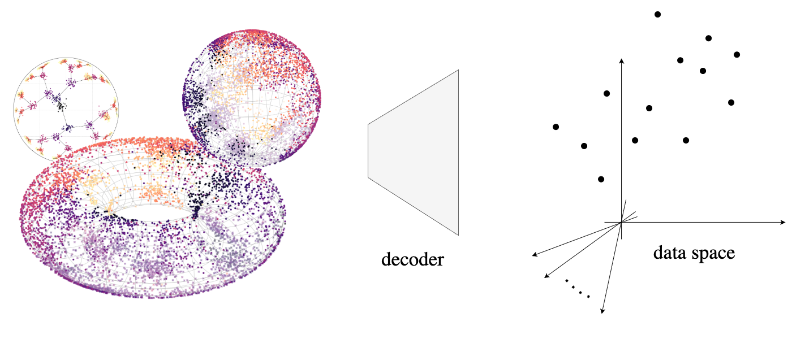

# Riemannian generative decoder

Riemannian representation learning typically relies on approximating densities on chosen manifolds. This involves optimizing difficult objectives, potentially harming models. To completely circumvent this issue, we introduce the Riemannian generative decoder, finding manifold-valued maximum likelihood latents with a Riemannian optimizer while training a decoder network. By discarding the encoder, we vastly simplify the manifold constraint compared to current approaches which often only handle few specific manifolds. We validate our approach on three case studies — a synthetic branching diffusion process, human migrations inferred from mitochondrial DNA, and cells undergoing a cell division cycle — each showing that learned representations respect the prescribed geometry and capture intrinsic non-Euclidean structure. Our method requires only a decoder, is compatible with existing architectures, and yields interpretable latent spaces aligned with data geometry.


_**tl;dr:** Simpler representation learning on manifolds. We propose a decoder-only framework to learn latents on arbitrary Riemannian manifolds via maximum likelihood and Riemannian optimization. We highlight its use with biological case studies._


<figure><figcaption><p><em><strong>Figure 1: Methodological overview</strong>. A decoder reconstructs data from Riemannian manifolds where representations are optimized as model parameters via maximum likelihood.</em></p></figcaption></figure>

### Motivation

\[to be added]



Each tab is like a mini page — it can contain multiple other blocks, of any type. So you can add code blocks, images, integration blocks and more to individual tabs in the same tab block.



Add images, embedded content, code blocks, and more.

```javascript
const handleFetchEvent = async (request, context) => {
    return new Response({message: "Hello World"});
};
```



### Expandable sections

<details>

<summary>Click me to expand</summary>

Expandable blocks are helpful in condensing what could otherwise be a lengthy paragraph. They are also great in step-by-step guides and FAQs.

</details>

### Drawings


### Embedded content




GitBook supports thousands of embedded websites out-of-the-box, simply by pasting their links. Feel free to check out which ones[ are supported natively](https://iframely.com).


